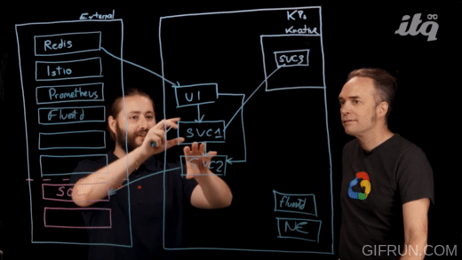

# Welcome to mestredelpino's GitHub 👋

<h2 align="left">Languages and Frameworks:</h2>

<a href="https://www.python.org/" target="_blank"> 
<a href="https://developer.mozilla.org/en-US/docs/Web/JavaScript" target="_blank"> 

<a href="https://yaml.org/" target="_blank"> 

  

<h2 align="left">Tools:</h2>
<a href="https://kubernetes.io/" target="_blank"> 
<a href="https://git-scm.com/" target="_blank"> 

<a href="https://argoproj.github.io/argo-cd/" target="_blank"> 
<a href="https://www.terraform.io/" target="_blank"> 

  
<a href="https://concourse-ci.org/" target="_blank"> 
<a href="https://tanzu.vmware.com/" target="_blank"> 

<a href="https://carvel.dev/" target="_blank"> 
  

<h2 align="left">Videos:</h2>

<h4 align="left">Desgning a portable cloud-native application in Google Cloud</h4>

  

  

    
  

  <h4 align="left">Automated TKG deployment on VMware Cloud on AWS</h4>
  

    
  

  
  
  

<h2 align="left">Connect with me:</h2>

Visit <a href="https://mestredelpino.com" target="_blank" style="color: #333; font-weight: bold; text-decoration: none;">mestredelpino.com</a> for more content!

 

<!--
**mestredelpino/mestredelpino** is a ✨ _special_ ✨ repository because its `README.md` (this file) appears on your GitHub profile.

Here are some ideas to get you started:

- 🔭 I’m currently working on ...
- 🌱 I’m currently learning ...
- 👯 I’m looking to collaborate on ...
- 🤔 I’m looking for help with ...
- 💬 Ask me about ...
- 📫 How to reach me: ...
- 😄 Pronouns: ...
- ⚡ Fun fact: ...
-->
